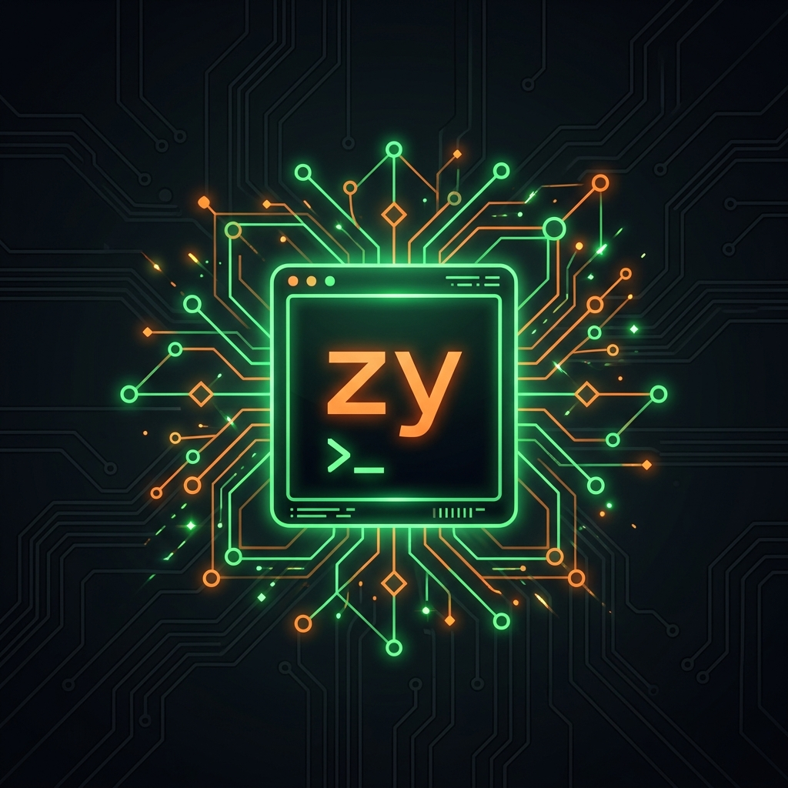

# ⚡ zy: The Super-Intelligent Local AI Agent


`zy` is a super-powerful, 100% local, autonomous AI CLI Agent built in pure Rust. It wraps around [Ollama](https://ollama.com/) to give you a Copilot-level pair programmer, a DevOps engineer, and an autonomous coding agent directly in your terminal. 

No APIs. No subscriptions. No internet required.

---

## ✊ The "Broke Developer" Manifesto
`zy` democratizes AI. If you are a developer with a low budget, coding on an older laptop, or dealing with spotty internet, `zy` is built for you:
- **$0.00 Forever:** Replaces $50+/mo subscriptions (Copilot, ChatGPT Plus, Claude Pro).
- **Runs on Potatoes:** The built-in **AiTuner** dynamically detects low RAM (e.g., 8GB) and automatically activates `ECO MODE`, throttling LLM context and CPU threads so your laptop doesn't crash or overheat.
- **100% Offline:** You can code in a cabin in the woods with no WiFi. Your code never leaves your machine.
- **Your Free Senior Engineer:** Can't afford a DevOps or QA team? `zy` will write your Dockerfiles, fix your CI/CD pipelines, and debug your SQL autonomously.

---

## 🚀 God-Tier Features

### 🖥️ Interactive TUI & Beautiful Spinners
You don't need to memorize arcane CLI flags. Just run `zy` and it boots into a beautiful Terminal User Interface (TUI). Select your model from a dropdown, toggle Agent/RAG modes, and watch gorgeous progress spinners when the AI is working.

### 🤖 Agentic Tool Calling (100% Autonomous)
When you enable **Agent Mode**, `zy` doesn't just talk—it *does*. It can autonomously execute Bash commands, read your directories, and edit files on your hard drive. 
*(Includes an interactive Safety Prompt to confirm dangerous commands, or `--force` if you trust the machine).*

### 👁️ Vella Zero-Latency OS Watcher (RAG)
`zy` integrates the enterprise **Vella Framework** OS watcher (`notify`). Run `zy watch` in the background, and the exact millisecond you hit `Save` in your IDE, `zy` instantly chunks and re-embeds your code into its RAG Vector Database. Your AI always has 100% real-time knowledge of your codebase.

### 🧠 Dynamic AiTuner (Eco vs Turbo Mode)
`zy` reads your bare-metal OS stats on boot:
*   **ECO MODE (<12GB RAM):** Hard-caps LLM context and shrinks the conversational sliding window to prevent Out-Of-Memory (OOM) crashes on older laptops.
*   **TURBO MODE (12GB+ RAM):** Saturates all CPU cores and expands the context window to 8192 tokens for deep reasoning on high-end rigs.

### ⌨️ Native Slash Commands
Inside the chat REPL, you can hot-swap everything mid-conversation without restarting:
`/model llama3.2` | `/rag on` | `/agent on` | `/clear` | `/save my_session`

---

## ⏳ The Time-Traveling Pair Programmer
No matter what era of code you are maintaining, `zy` is trained to dominate it:

*   **The 90s (C/C++, Makefiles):** Feed `zy` a raw core dump or GDB output and it will explain the exact pointer arithmetic that caused your Segmentation Fault.
*   **The 2000s (PHP, Classic ASP, SOAP):** `zy` can untangle 5,000-line "spaghetti" PHP files into clean MVC architecture, or translate heavy XML/SOAP WSDLs into modern JSON REST APIs.
*   **The 2010s (Docker, JS Callbacks):** `zy` can auto-generate your `Dockerfile` and `docker-compose.yml`, or refactor nested Node.js "callback hell" into clean ES6 `async/await`.
*   **The 2020s (Rust, Edge, Web3):** `zy` writes blazing-fast Rust, scaffolds Next.js Edge APIs, and can even audit your Solidity smart contracts for reentrancy attacks.

---

## 🛠️ Installation & Usage

### Prerequisites
1. Install [Rust](https://rustup.rs/)
2. Install [Ollama](https://ollama.com/)
3. Pull an embedding model for RAG: `ollama pull nomic-embed-text`
4. Pull a chat model (e.g., `ollama pull qwen2.5-coder:1.5b` or `llama3.2`)

### Build & Run
```bash
git clone <your-repo>/zy
cd zy
cargo build --release
```

**Run the Interactive Wizard:**
```bash
cargo run
```

**Index your Codebase (RAG):**
```bash
cargo run -- index .
```

**Run the Vella Auto-Sync Daemon:**
```bash
cargo run -- watch
```

---

## 🛡️ Cybersecurity: White Hat vs Black Hat Usage

Because `zy` is a 100% local, air-gapped agent, it is not bound by the safety filters, rate limits, or corporate oversight of cloud APIs (like OpenAI or Anthropic). `zy` is a neutral tool—a highly advanced terminal interface. How it behaves depends entirely on the **Model (The Brain)** you plug into it.

### 🏴‍☠️ The Uncensored Loophole
Standard models (like `llama3.2`) will refuse to write exploits or malicious code. However, a user can easily download an **uncensored model** (like `dolphin-llama3`) via Ollama. When paired with `zy`'s Agent Mode (`--agent`) and the Force flag (`--force`), an uncensored AI can be weaponized to autonomously run `nmap` scans, execute network scripts, or attempt lateral movement without human intervention.

### 🛡️ The Ultimate Blue Team Defender
Conversely, `zy` is a superpower for Cybersecurity Defenders (White Hats):
*   **Air-Gapped Malware Analysis:** You can feed `zy` a malicious payload or obfuscated script inside an isolated sandbox. Because `zy` requires zero internet connection, the malware cannot dial home while the AI reverse-engineers it.
*   **Automated Zero-Day Auditing:** Using `zy index .`, you can have the AI ingest massive proprietary codebases and audit them for Reentrancy attacks, buffer overflows, or logic flaws locally.

**This is exactly why the Interactive Safety Prompt exists.** Unless you explicitly pass the `-F` (Force) flag, `zy` will halt and ask for your `[Y/n]` permission before executing *any* Bash command or File Write—ensuring the human operator always holds the kill switch.
